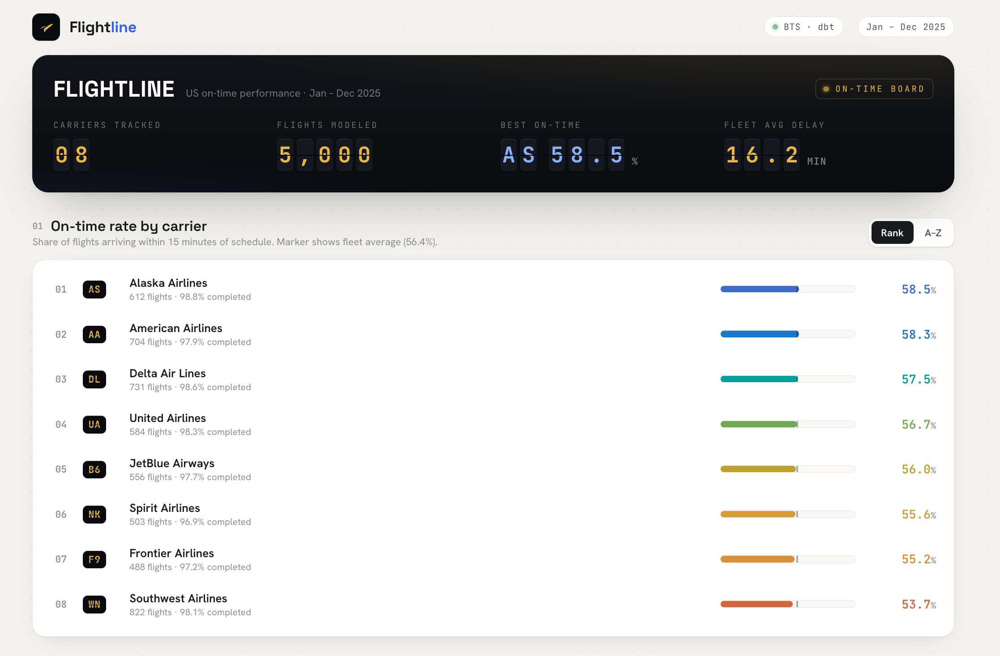
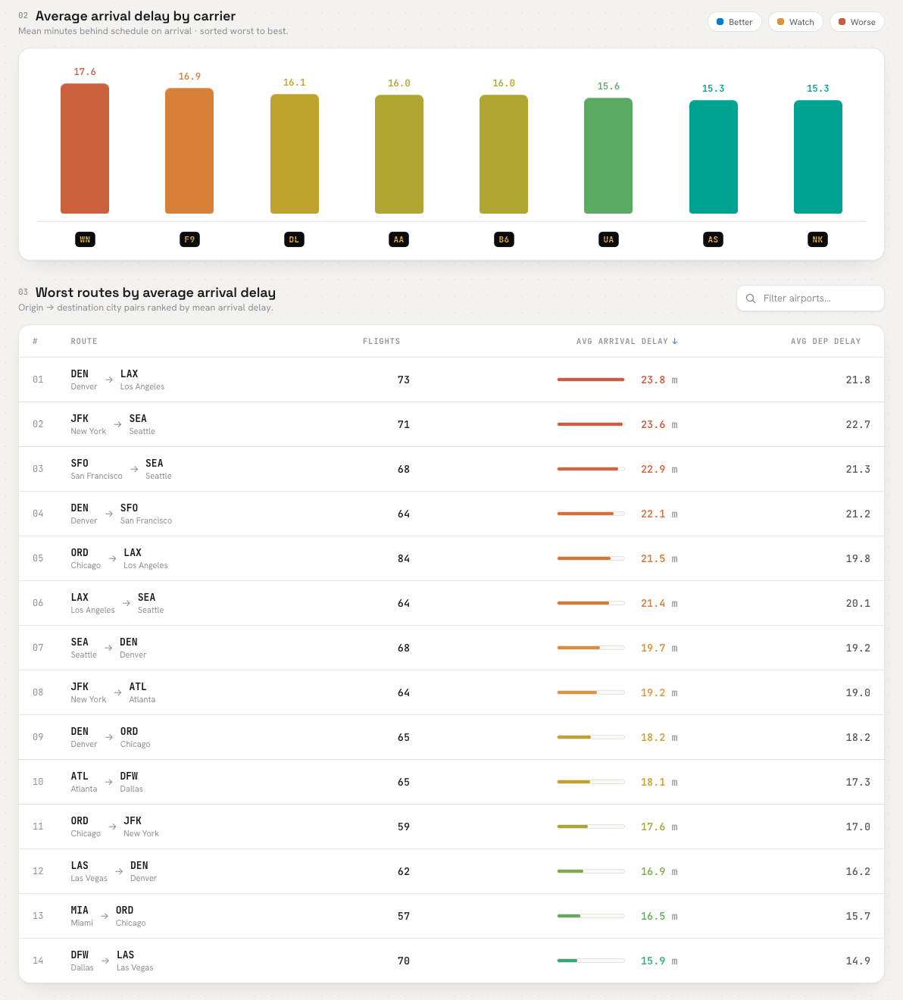

# Flightline — End-to-End Flight Data Pipeline

> US carrier on-time performance, ingested from BTS, modeled with dbt, served on a live dashboard.




---

## What it does

Flightline is a production-patterned data pipeline that pulls monthly US flight performance data from the Bureau of Transportation Statistics, loads it into Snowflake, transforms it with dbt, and serves carrier rankings and worst-route analytics on a Streamlit dashboard.

It is built as two paths with different SLAs:

- **Batch path (live):** BTS On-Time Performance CSVs → Airflow DAG → Snowflake RAW → dbt staging + marts → Streamlit
- **Streaming path (scaffolded):** OpenSky live state vectors → OAuth2 poller → Kafka → Snowflake RAW

---

## Stack

| Layer | Tool |
|---|---|
| Orchestration | Apache Airflow 2.10 |
| Warehouse | Snowflake (key-pair auth) |
| Transformation | dbt-snowflake 1.8, dbt_utils |
| Dashboard | Streamlit |
| Containerization | Docker + docker-compose |
| CI | GitHub Actions (sqlfluff lint + dbt build) |
| Streaming (Phase 2) | OpenSky REST API + Kafka |

---

## Architecture

```
OpenSky (OAuth2) → Kafka → consumer ─┐
                                      ├─→ Snowflake RAW → dbt staging → dbt marts → Streamlit
BTS TranStats → Airflow DAG ──────────┘
```

---

## Design decisions (the why, not just the what)

**Idempotent loads**
The loader deletes the `(year, month)` partition before `COPY INTO`, so re-running a DAG or backfilling never duplicates rows. Re-runnability is a first-class requirement, not an afterthought.

**`MATCH_BY_COLUMN_NAME` on COPY**
BTS files ship with ~110 columns. The Snowflake target table declares only the 25 we use. COPY maps by header and ignores the rest, so the pipeline does not break when BTS adds or reorders columns.

**dbt `build` in the DAG**
`dbt build` runs models and tests in dependency order in a single command. A failing test fails the DAG run, which is the correct behavior: bad data should never silently reach the marts.

**Surrogate key + dedup in staging**
BTS occasionally re-publishes corrected rows for the same flight. The staging model generates a surrogate key over the natural flight identifier and uses `row_number()` to keep exactly one row per flight leg.

**Key-pair auth, not password**
Snowflake deprecated single-factor password authentication in late 2025. The pipeline uses RSA key-pair auth throughout: the private key is loaded at runtime, never stored in config files, and the service user has no MFA requirement. This is the correct pattern for programmatic access.

**Kafka for decoupling, not throughput**
At OpenSky poll volumes, a direct write to Snowflake would work. Kafka is here so the poller and the loader are independent processes: the loader can crash and restart without data loss, and a second consumer (alerting, anomaly detection) can be added without touching the producer. The design earns Kafka rather than bolting it on.

---

## dbt project

```
models/
  staging/
    stg_bts__ontime.sql        # dedup, surrogate key, type casting
  marts/
    fct_flights.sql            # one row per flight, on-time flag, delay measures
    dim_carrier.sql            # carrier dimension with friendly names
    agg_carrier_ontime.sql     # on-time rate + avg delay per carrier
    agg_route_delay.sql        # worst routes by mean arrival delay (min 30 flights)
tests/
    assert_no_negative_distance.sql
    assert_delay_components_reconcile.sql
```

**26/26 tests passing** including two custom singular tests encoding real business rules:
- Flights cannot have negative distance
- When a flight is 15+ min late, the BTS delay-cause buckets must reconcile to the arrival delay within 5 minutes

---

## Quickstart

### Prerequisites
- Docker Desktop
- Python 3.11+
- Snowflake trial account (free, $400 credits, no credit card)
- RSA key pair for Snowflake auth (see below)

### 1. Clone and configure

```bash
git clone https://github.com/bhavyaupadhyayy/Flightline-End-to-End-Flight-Data-Pipeline.git
cd Flightline-End-to-End-Flight-Data-Pipeline
cp .env.example .env
cp dbt/flightline/profiles.yml.example dbt/flightline/profiles.yml
```

### 2. Generate a key pair for Snowflake

```bash
mkdir -p ~/.snowflake_keys
openssl genrsa 2048 | openssl pkcs8 -topk8 -inform PEM \
  -out ~/.snowflake_keys/flightline_key.p8 -nocrypt
openssl rsa -in ~/.snowflake_keys/flightline_key.p8 \
  -pubout -out ~/.snowflake_keys/flightline_key.pub
```

Register the public key in Snowflake:
```sql
ALTER USER your_service_user SET RSA_PUBLIC_KEY = '<contents of flightline_key.pub>';
```

### 3. Fill in `.env`

```
SNOWFLAKE_ACCOUNT=yourorg-accountname
SNOWFLAKE_USER=your_service_user
SNOWFLAKE_PRIVATE_KEY_PATH=~/.snowflake_keys/flightline_key.p8
SNOWFLAKE_ROLE=ACCOUNTADMIN
SNOWFLAKE_WAREHOUSE=COMPUTE_WH
SNOWFLAKE_DATABASE=FLIGHTLINE
FLIGHTLINE_SAMPLE=1
```

Set `FLIGHTLINE_SAMPLE=1` to run with synthetic data first (no BTS download needed).

### 4. Run the pipeline

```bash
# Start Airflow
make up
# Open http://localhost:8080 (admin / admin)
# Unpause and trigger bts_batch DAG

# Or run the batch locally without Airflow
python -m venv .venv && source .venv/bin/activate
pip install -r requirements.txt
python run_batch.py

# Run dbt manually
cd dbt/flightline
dbt deps && dbt build --profiles-dir . --target prod

# Launch dashboard
streamlit run dashboard/app.py
```

---

## Repo layout

```
airflow/            Dockerfile + DAGs (bts_batch)
ingestion/
  bts_extract.py    BTS download with offline sample fallback
  validate.py       Pre-load data quality gate
  snowflake_loader.py  Idempotent PUT + COPY loader
  opensky_poller.py    OAuth2 live state vector poller (Phase 2)
dbt/flightline/     Sources, staging, marts, tests, seeds, macros
dashboard/          Streamlit app (Snowflake or DuckDB backend)
.github/workflows/  CI: sqlfluff lint + dbt build on ephemeral schema
```

---

## CI

Every push runs:
1. `sqlfluff lint` on all SQL models
2. Python compile check across ingestion, dashboard, and DAGs
3. `dbt build` against an ephemeral CI schema (dropped after run)

The dbt CI job requires Snowflake secrets configured in GitHub Actions settings.

---

## Roadmap

- [x] Phase 1: batch backbone — BTS → Airflow → Snowflake → dbt → Streamlit + CI
- [ ] Phase 2: streaming — OpenSky → Kafka → consumer → Snowflake live positions table
- [ ] Phase 3: incremental dbt models, snapshots, source freshness alerting, MotherDuck mirror for a permanently-live public dashboard
